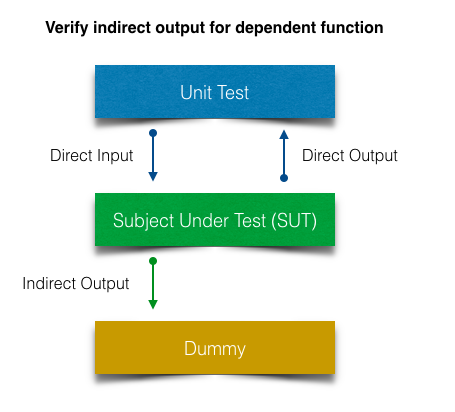
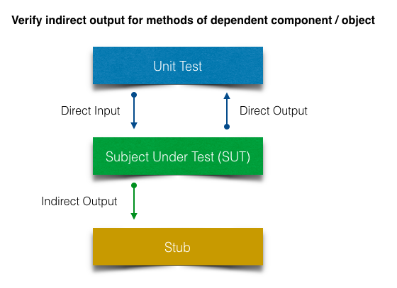
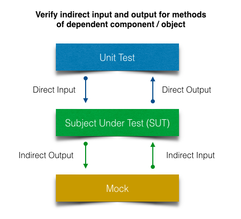

# soother


> soother is a cross-browser standalone library that provide test dummies, stubs, mocks, fakes and spies for JavaScript. Works with any unit testing framework.

[](https://www.npmjs.com/package/soother)


## Notes
It's a quite different but very simple.

The library makes use of an idiomatically different style than other libraries that using stubs.

Feel free to open merge requests with upgrades and report issues.

[GitHub Repository](https://github.com/archik408/soother)


## Getting Started

```
npm install soother --save-dev
```

### Dummy
>A minimal function is which does nothing and returns nothing

from 'K&amp;R' (c)



```javascript
        import Soother from 'soother';

        const instance = new Object();
        instance.test = Soother.dummy();
        instance.test('test');
        const [firstCall] = instance.test.calls;
        const [argOfCall] = firstCall.args;
        expect(argOfCall).to.equal('test');
```

### Stub



```javascript
        const stubbedInstance = Soother.stub(instance);

        stubbedInstance.test();
        stubbedInstance.otherMethod();
        stubbedInstance.anyOther();

        stubbedInstance.test('test');
        stubbedInstance.otherMethod();
        stubbedInstance.anyOther();

        expect(stubbedInstance.test.calls.length).to.equal(2);
        expect(stubbedInstance.otherMethod.calls.length).to.equal(2);
        expect(stubbedInstance.anyOther.calls.length).to.equal(2);
        
        const [, methodCall] = stubbedInstance.test.calls;
        const [callArg] = methodCall.args;
        expect(callArg).to.equal('test');
```

### Mock



```javascript
        let mockInstance = Soother.mock(instance, {
            test: () => 'mock'
        });
        mockInstance.testProperty = 1;
        expect(mockInstance.test()).to.equal('mock');
        expect(mockInstance.testProperty.calls.length).to.equal(1);

        mockInstance = Soother.mock(instance, {
            testProperty: 'mock'
        });
        expect(mockInstance.testProperty).to.equal('mock');
        mockInstance.test();
        expect(mockInstance.test.calls.length).to.equal(1);
```

### Spy

```javascript
        const spyInstance = Soother.spy(instance);

        spyInstance.test('spy');
        const prop = spyInstance.testProperty;
        expect(prop).to.equal('test');
        spyInstance.testProperty = 'spy';
        spyInstance.test = 'spy';

        const { sets, gets } = spyInstance.spied;
        const [firstSet] = sets;
        const [firstGet] = gets;
        expect(sets.length).to.equal(2);
        expect(gets.length).to.equal(2);
        expect(firstGet.type).to.equal('method');
        expect(firstGet.args.length).to.equal(3);
        expect(firstSet.testProperty).to.equal('spy');
```

### Fake AJAX

Example with `XMLHttpRequest`

```javascript
        import Soother from 'soother';

        const url = 'http://www.test.org/test.txt';

        const fake = Soother.fakeXMLHttpRequest();
        fake.register('GET', url, 'test response');


        const oReq = new XMLHttpRequest();
        oReq.onreadystatechange = () => {
            expect(oReq.responseText).to.equal('test response');
        };
        
        oReq.open('GET', url);
        oReq.setRequestHeader('Content-Type', 'text/html; charset=utf-8');
        oReq.send();

        expect(oReq.getResponseHeader('Content-Type')).to.equal('text/html; charset=utf-8');
        expect(oReq.getAllResponseHeaders()).to.equal(null);

        const [firstCall] = fake.calls();
        expect(firstCall.method).to.equal('GET');
        expect(firstCall.url).to.equal('http://www.test.org/test.txt');
        expect(firstCall.data).to.equal(undefined);

        const methods = fake.methods();
        expect(methods.GET[url]).to.equal('test response');
```

Example with [axios](https://github.com/axios/axios)

```javascript
    import Axios from 'axios';
    import { SESSION_API_URL } from '../../constants';
    
    /**
     * Call specific endpoint via HTTP and read items
     *
     * @returns {AxiosPromise} Promise to return all items
     */
    export function getItems() {
        return Axios.get(`${SESSION_API_URL}/items`);
    }
    
```
```javascript
    import Soother from 'soother';
    import { getItems } from '../itemService';
    
    describe('Test Item API Service', () => {
        let fakeAjax = null;
    
        beforeEach(done => {
            fakeAjax = Soother.fakeXMLHttpRequest();
            done();
        });
    
        it('should provide method for getting items', done => {
            getItems().then(() => {
                const [call] = fakeAjax.calls();
    
                expect(call.method).to.be.equal('GET');
                expect(call.url).to.be.equal('/api/v1/items');
    
                done();
            }).catch(done);
        });
```
You also can setup fake backend with end-point mocks
```javascript

import Soother from 'soother';

// TODO remove after integration
export default function fakeBackend() {
    const fakeAjax = Soother.fakeXMLHttpRequest();

    const url = '/api/v1/item';

    const list = [{ name: '9' }, { name: '10' }];
    const item = { name: '11' };

    fakeAjax.register('GET', `${url}s`, list);
    fakeAjax.register('POST', url, item);
    fakeAjax.register('PUT', url, item);
    fakeAjax.register('DELETE', `${url}/11`, item);
}
```


### Stub and Mock CommonJS modules
```javascript
        const ms = Soother.moduleSoother();
        ms.mockModule('.\.css$', { test: 'test' });
        ms.stubModule('.\.svg$');

        const svg1 = require('./icon_1.svg');
        const svg2 = require('./icon_2.svg');

        const css1 = require('./styles_1.css');
        const css2 = require('./styles_2.css');

        expect(svg1).to.equal({});
        expect(svg2).to.equal({});

        expect(css1.test).to.equal('test');
        expect(css2.test).to.equal('test');
```

## Alternatives

* [sinonjs](https://github.com/sinonjs/)
* [testdouble.js](https://github.com/testdouble/testdouble.js)
* [jest - mock functions](https://facebook.github.io/jest/docs/en/mock-functions.html)


## Tests

`cd soother`

`npm i`

`npm test`

Then check ./coverage/report.html


## License
Copyright (c) 2017 artur.basak aka archik
Licensed under the Apache-2.0 license.
